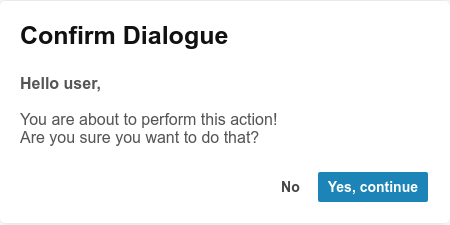

<h1 align="center" style="color: rgb(7, 128, 228)">
    <a href="https://r-tek.github.io/colr_pickr/" target="blank">
        
         
        Colr Pickr
    </a>
</h1>

    <b>Colr Pickr, a vanilla JavaScript color picking component built with SVGs, with features like saving colors. Similar design to the chrome-dev-tools color picker</b>

    
    
    
    
    

 

---
